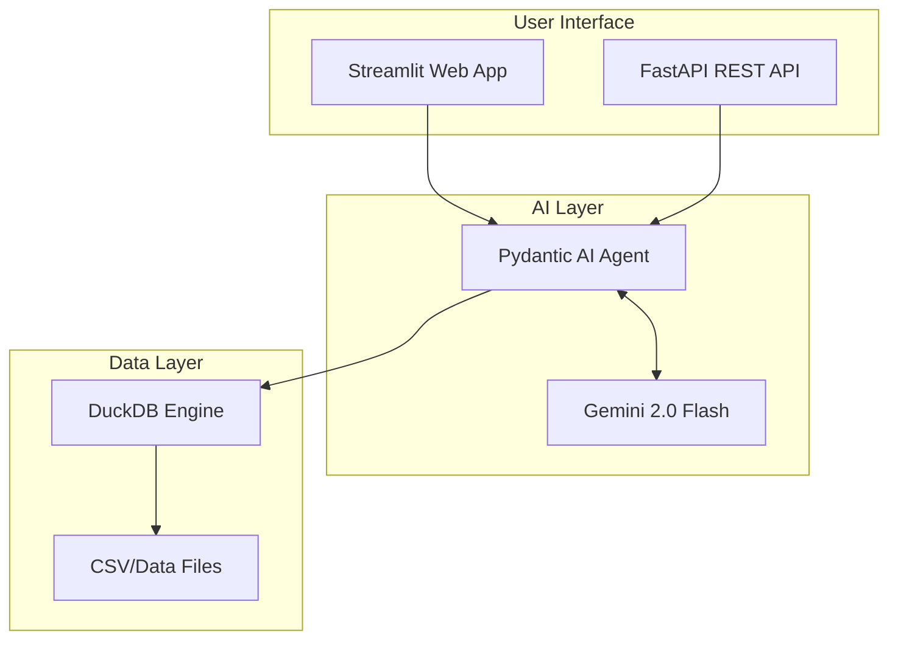

# Autonomous Data Analyst

[](https://github.com/lord-dubious/autonomous-data-analyst/actions/workflows/ci.yml)
[](https://www.python.org/downloads/)
[](https://opensource.org/licenses/MIT)
[](https://ai.pydantic.dev/)
[](https://duckdb.org/)

An AI-powered data analyst that uses natural language to analyze your data. Upload a CSV, ask questions in plain English, and get insights with automatically generated visualizations.

## Features

- **Natural Language Queries** - Ask questions about your data in plain English
- **Auto-Generated Charts** - Plotly visualizations based on AI recommendations
- **DuckDB Backend** - Fast in-process SQL analytics (no database setup required)
- **Type-Safe AI** - Pydantic AI for validated, structured LLM responses
- **Dual Interface** - Streamlit web UI + FastAPI REST API
- **Conversation History** - Track your analysis session
- **Export Results** - Download data as CSV or charts as images
- **Docker Ready** - One-command deployment with Docker Compose

## Architecture



## Quick Start

### Prerequisites

- Python 3.11+
- [Gemini API Key](https://aistudio.google.com/app/apikey) (free tier available)

### Local Development

```bash
# Clone the repository
git clone https://github.com/lord-dubious/autonomous-data-analyst
cd autonomous-data-analyst

# Create virtual environment
python -m venv venv
source venv/bin/activate  # On Windows: venv\Scripts\activate

# Install dependencies
pip install -r requirements.txt

# Set up environment variables
cp .env.example .env
# Edit .env and add your GEMINI_API_KEY

# Run Streamlit app
streamlit run app/streamlit_app.py

# Or run FastAPI server
uvicorn api.main:app --reload
```

### Docker

```bash
# Set your API key
export GEMINI_API_KEY=your_key_here

# Run with Docker Compose
docker-compose up

# Access:
# - Streamlit UI: http://localhost:8501
# - FastAPI Docs: http://localhost:8000/docs
```

## Usage

### Web Interface (Streamlit)

1. Open http://localhost:8501
2. Upload a CSV file using the sidebar
3. Ask questions like:
   - "What is the total revenue by region?"
   - "Show me sales trends over time"
   - "Which product has the highest quantity sold?"
4. View AI-generated insights and charts
5. Export results as needed

### REST API (FastAPI)

```python
import httpx

# Analyze data
with open("data.csv", "rb") as f:
    response = httpx.post(
        "http://localhost:8000/analyze",
        files={"file": f},
        data={"question": "What is the average revenue?"}
    )
    print(response.json())
```

API documentation available at http://localhost:8000/docs

## Tech Stack

| Layer | Technology | Purpose |
|-------|------------|---------|
| **LLM** | Gemini 2.0 Flash | Fast, capable language model |
| **Agent Framework** | Pydantic AI | Type-safe, validated AI responses |
| **Database** | DuckDB | In-process SQL analytics |
| **Web UI** | Streamlit | Interactive data apps |
| **REST API** | FastAPI | High-performance API |
| **Charts** | Plotly | Interactive visualizations |
| **Testing** | pytest + pytest-recording | Deterministic LLM testing |

## Project Structure

```
autonomous-data-analyst/
├── src/data_analyst/     # Core library
│   ├── agent.py          # Pydantic AI agent
│   ├── database.py       # DuckDB interface
│   ├── models.py         # Pydantic models
│   └── tools.py          # Agent tools
├── app/                  # Streamlit application
│   └── streamlit_app.py
├── api/                  # FastAPI application
│   └── main.py
├── tests/                # Test suite
├── data/                 # Sample datasets
└── docker-compose.yml    # Docker configuration
```

## Development

### Setup

```bash
# Install dev dependencies
pip install -r requirements-dev.txt

# Install pre-commit hooks
pre-commit install

# Run tests
pytest

# Run linter
ruff check .
```

### Running Tests

```bash
# Run all tests
pytest

# Run with coverage
pytest --cov=src

# Run specific test file
pytest tests/test_agent.py -v
```

## Deployment

### Streamlit Cloud

1. Fork this repository
2. Connect to [Streamlit Cloud](https://streamlit.io/cloud)
3. Add `GEMINI_API_KEY` to secrets
4. Deploy!

### Railway / Render

1. Connect your GitHub repository
2. Set `GEMINI_API_KEY` environment variable
3. Deploy with the provided `Dockerfile`

## Contributing

Contributions are welcome! Please read our contributing guidelines and submit a PR.

1. Fork the repository
2. Create a feature branch (`git checkout -b feat/amazing-feature`)
3. Commit your changes (`git commit -m 'Add amazing feature'`)
4. Push to the branch (`git push origin feat/amazing-feature`)
5. Open a Pull Request

## License

This project is licensed under the MIT License - see the [LICENSE](LICENSE) file for details.

## Acknowledgments

- [Pydantic AI](https://ai.pydantic.dev/) for the type-safe agent framework
- [DuckDB](https://duckdb.org/) for the blazing-fast embedded database
- [Google Gemini](https://ai.google.dev/) for the LLM backbone
- [Streamlit](https://streamlit.io/) for the beautiful web interface
