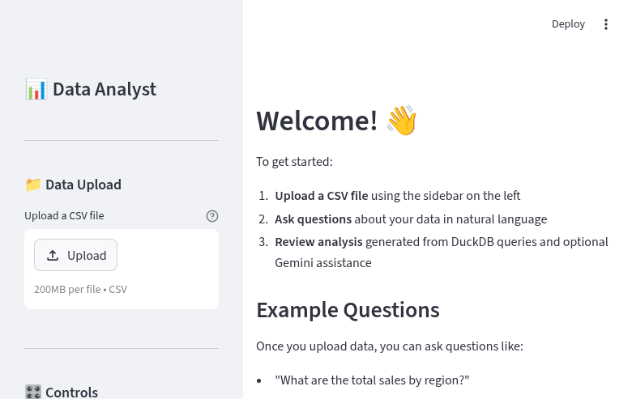
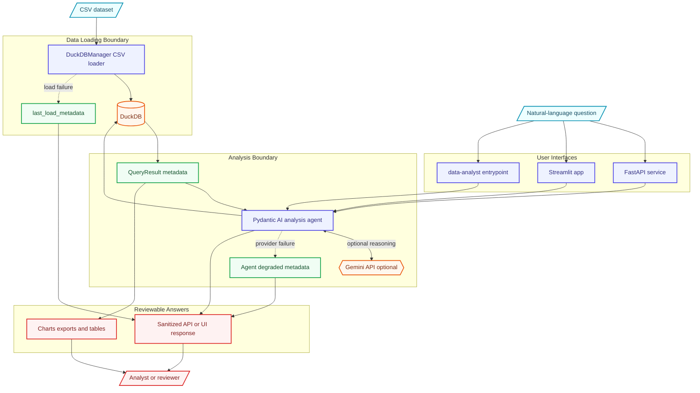

# Autonomous Data Analyst

[](https://github.com/lord-dubious/autonomous-data-analyst/actions/workflows/ci.yml)

## Portfolio Showcase



The screenshot is captured from the real Streamlit app (`streamlit run app/streamlit_app.py`) so reviewers can see the browser UI, upload workflow, and analysis entry point rather than a static CLI mockup.

- **Architecture deep dive:** [`docs/ARCHITECTURE.md`](docs/ARCHITECTURE.md)
- **Demo guide:** [`docs/DEMO.md`](docs/DEMO.md)
- **Reviewer focus:** DuckDB CSV loading, FastAPI/Streamlit/CLI surfaces, Pydantic AI analysis, and sanitized degraded metadata.

## Architecture Overview



## Features

- **Natural Language Queries** - Ask questions about your CSV data when Gemini is available
- **Generated Charts** - Plotly visualizations based on returned analysis metadata
- **DuckDB Backend** - Fast in-process SQL analytics (no database setup required)
- **Agent Integration** - Pydantic AI tools around DuckDB queries and schema inspection
- **Dual Interface** - Streamlit web UI + FastAPI REST API
- **Conversation History** - Track your analysis session
- **Export Results** - Download data as CSV or charts as images
- **Docker Ready** - One-command deployment with Docker Compose

## Quick Start

### Prerequisites

- Python 3.11+
- [Gemini API Key](https://aistudio.google.com/app/apikey) (free tier available)

### Local Development

```bash
# Clone the repository
git clone https://github.com/lord-dubious/autonomous-data-analyst
cd autonomous-data-analyst

# Create virtual environment
python -m venv venv
source venv/bin/activate  # On Windows: venv\Scripts\activate

# Install dependencies
pip install -r requirements.txt

# Set up environment variables
cp .env.example .env
# Edit .env and add your GEMINI_API_KEY

# Run Streamlit app
streamlit run app/streamlit_app.py

# Or run FastAPI server
uvicorn api.main:app --reload
```

### Docker

```bash
# Set your API key
export GEMINI_API_KEY=your_key_here

# Run with Docker Compose
docker-compose up

# Access:
# - Streamlit UI: http://localhost:8501
# - FastAPI Docs: http://localhost:8000/docs
```

## Usage

### Web Interface (Streamlit)

1. Open http://localhost:8501
2. Upload a CSV file using the sidebar
3. Ask questions like:
   - "What is the total revenue by region?"
   - "Show me sales trends over time"
   - "Which product has the highest quantity sold?"
4. Review generated analysis text, query results, and any charts
5. Export results as needed

### REST API (FastAPI)

The API is available at http://localhost:8000 with interactive docs at `/docs`.

#### Endpoints

| Endpoint | Method | Description |
|----------|--------|-------------|
| `/health` | GET | Health check |
| `/analyze` | POST | Gemini-assisted analysis with file upload |
| `/query` | POST | Execute SQL queries on uploaded data |
| `/schema` | POST | Get schema of uploaded CSV |

#### Examples

**Python (httpx):**
```python
import httpx

# Analyze data with Gemini assistance
with open("data.csv", "rb") as f:
    response = httpx.post(
        "http://localhost:8000/analyze",
        files={"file": ("data.csv", f, "text/csv")},
        data={"question": "What is the total revenue by product?"}
    )
    result = response.json()
    print(result["analysis"])

# Execute SQL query
with open("data.csv", "rb") as f:
    response = httpx.post(
        "http://localhost:8000/query",
        files={"file": ("data.csv", f, "text/csv")},
        data={"sql": "SELECT product, SUM(revenue) FROM data GROUP BY product"}
    )
    result = response.json()
    print(result["data"])

Responses include `metadata` fields for CSV load, DuckDB query, and agent degraded/error boundaries when available.

# Get schema
with open("data.csv", "rb") as f:
    response = httpx.post(
        "http://localhost:8000/schema",
        files={"file": ("data.csv", f, "text/csv")}
    )
    schema = response.json()
    print(schema["tables"][0]["columns"])
```

**cURL:**
```bash
# Health check
curl http://localhost:8000/health

# Analyze data
curl -X POST http://localhost:8000/analyze \
  -F "file=@data.csv" \
  -F "question=What are the top products by revenue?"

# Execute SQL
curl -X POST http://localhost:8000/query \
  -F "file=@data.csv" \
  -F "sql=SELECT * FROM data LIMIT 5"

# Get schema
curl -X POST http://localhost:8000/schema \
  -F "file=@data.csv"
```

API documentation available at http://localhost:8000/docs

## Sample Data

The project includes sample sales data in `data/sample_sales.csv` with 100 records:

| Column | Type | Description |
|--------|------|-------------|
| `date` | DATE | Transaction date |
| `product` | VARCHAR | Product name |
| `category` | VARCHAR | Product category |
| `quantity` | INTEGER | Units sold |
| `unit_price` | DECIMAL | Price per unit |
| `revenue` | DECIMAL | Total revenue |
| `region` | VARCHAR | Sales region |
| `salesperson` | VARCHAR | Sales representative |

Try these example questions with the sample data:
- "What is the total revenue by region?"
- "Which salesperson has the highest sales?"
- "Show me the trend of revenue over time"
- "What are the top 5 products by quantity sold?"

## Tech Stack

| Layer | Technology | Purpose |
|-------|------------|---------|
| **LLM** | Gemini | Optional external model used by Pydantic AI |
| **Agent Framework** | Pydantic AI | Tool-calling wrapper for DuckDB-backed analysis |
| **Database** | DuckDB | In-process SQL analytics |
| **Web UI** | Streamlit | Interactive data apps |
| **REST API** | FastAPI | HTTP API for upload, schema, query, and analysis endpoints |
| **Charts** | Plotly | Interactive visualizations |
| **Testing** | pytest + pytest-recording | Deterministic LLM testing |

## Project Structure

```
autonomous-data-analyst/
├── src/data_analyst/     # Core library
│   ├── agent.py          # Pydantic AI agent
│   ├── database.py       # DuckDB interface
│   ├── models.py         # Pydantic models
│   └── tools.py          # Agent tools
├── app/                  # Streamlit application
│   └── streamlit_app.py
├── api/                  # FastAPI application
│   └── main.py
├── tests/                # Test suite
│   ├── test_api.py       # API endpoint tests
│   ├── test_agent.py     # Agent tests
│   └── test_database.py  # Database tests
├── data/                 # Sample datasets
│   └── sample_sales.csv  # 100 rows of demo data
└── docker-compose.yml    # Docker configuration
```

## Development

### Setup

```bash
# Install dev dependencies
pip install -r requirements-dev.txt

# Install pre-commit hooks
pre-commit install

# Run tests
pytest

# Run linter
ruff check .
```

### Running Tests

```bash
# Run all tests
pytest

# Run with coverage
pytest --cov=src

# Run specific test file
pytest tests/test_agent.py -v
```

## Deployment

### Streamlit Cloud (Recommended for UI)

1. Fork this repository
2. Connect to [Streamlit Cloud](https://streamlit.io/cloud)
3. Set `GEMINI_API_KEY` in Secrets:
   ```toml
   GEMINI_API_KEY = "your_api_key_here"
   ```
4. Deploy from `app/streamlit_app.py`

### Railway (Recommended for API)

1. Create a new project on [Railway](https://railway.app)
2. Connect your GitHub repository
3. Add environment variable: `GEMINI_API_KEY=your_key`
4. Railway will auto-detect the Dockerfile
5. Access your API at the provided domain

### Render

1. Create a new Web Service on [Render](https://render.com)
2. Connect your GitHub repository
3. Select "Docker" as environment
4. Add environment variable: `GEMINI_API_KEY`
5. Set start command:
   - For Streamlit: `streamlit run app/streamlit_app.py --server.port=$PORT`
   - For API: `uvicorn api.main:app --host=0.0.0.0 --port=$PORT`

### Docker Production

```bash
# Build image
docker build -t data-analyst .

# Run Streamlit
docker run -p 8501:8501 -e GEMINI_API_KEY=your_key data-analyst \
  streamlit run app/streamlit_app.py

# Run FastAPI
docker run -p 8000:8000 -e GEMINI_API_KEY=your_key data-analyst \
  uvicorn api.main:app --host=0.0.0.0 --port=8000
```

## Environment Variables

| Variable | Required | Description |
|----------|----------|-------------|
| `GEMINI_API_KEY` | Required for `/analyze` and chat assistance | Google Gemini API key. `/query` and `/schema` use DuckDB and do not call Gemini. |

## Contributing

Contributions are welcome! Please read our contributing guidelines and submit a PR.

1. Fork the repository
2. Create a feature branch (`git checkout -b feat/amazing-feature`)
3. Commit your changes (`git commit -m 'Add amazing feature'`)
4. Push to the branch (`git push origin feat/amazing-feature`)
5. Open a Pull Request

## License

This project is licensed under the MIT License - see the [LICENSE](LICENSE) file for details.

## Acknowledgments

- [Pydantic AI](https://ai.pydantic.dev/) for the agent tool framework
- [DuckDB](https://duckdb.org/) for the embedded SQL engine
- [Google Gemini](https://ai.google.dev/) for optional model-assisted responses
- [Streamlit](https://streamlit.io/) for the web interface
