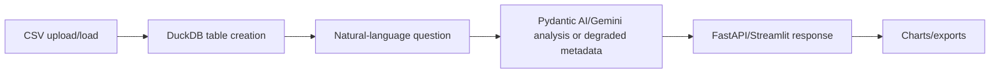

# Architecture

CSV and DuckDB data-analysis assistant with FastAPI, Streamlit, Pydantic AI, and safe degraded metadata for failed loads/queries/analysis.

This document is written for reviewers who want to understand how the project is shaped before reading the code. It emphasizes boundaries, dependencies, and degraded paths rather than marketing claims.

## Data Flow

1. CSV upload/load
2. DuckDB table creation
3. Natural-language question
4. Pydantic AI/Gemini analysis or degraded metadata
5. FastAPI/Streamlit response
6. Charts/exports

## Main Components

- **DuckDB manager**: Loads CSV files and records load/query metadata for callers.
- **Agent layer**: Returns analysis metadata instead of leaking provider failures.
- **FastAPI API**: Surfaces sanitized response metadata at service boundaries.
- **Streamlit app**: Provides an interactive local UI for datasets and questions.

## External Dependencies

- Python 3.11+
- DuckDB
- FastAPI
- Streamlit
- Optional Gemini/Pydantic AI configuration

The project is intentionally explicit about optional services. Mock, fallback, and degraded paths are labeled in result metadata so a demo cannot be mistaken for a successful production integration.

## Failure And Degraded Modes

- External-service failures are captured as warnings, status fields, or source metadata where the domain model supports it.
- Mock/demo behavior is opt-in or explicitly labeled.
- Generated outputs are treated as review candidates, not authoritative decisions.
- CLI output remains user-facing; library internals use logging or structured metadata.

## What To Review In Code

- CSV load and query metadata make failures explainable.
- Docker build and import smoke tests pass in CI.
- The app offers both API and Streamlit portfolio surfaces.

## Current Limits

- Analysis quality depends on dataset cleanliness and schema inference.
- Gemini/Pydantic AI paths need API configuration.
- Generated insights should be checked against the underlying data.
